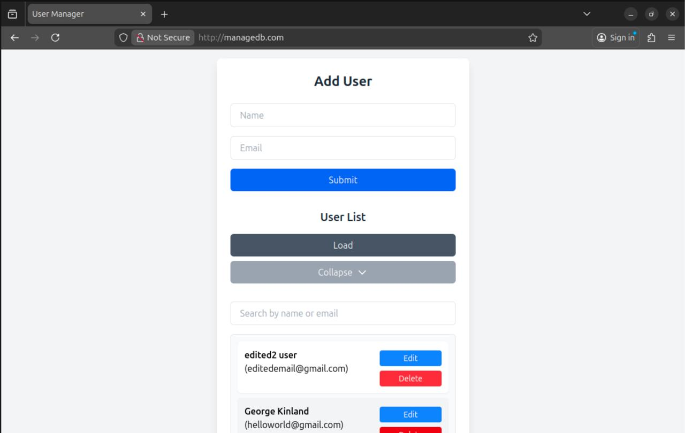
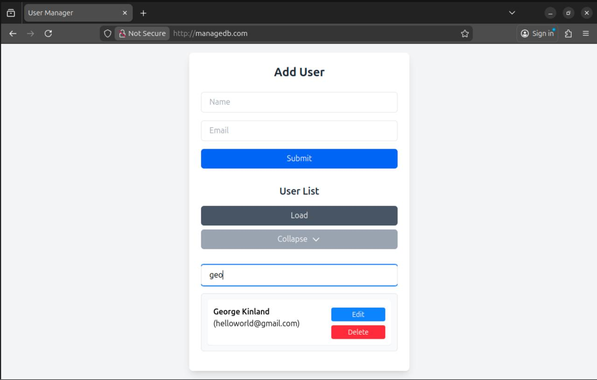
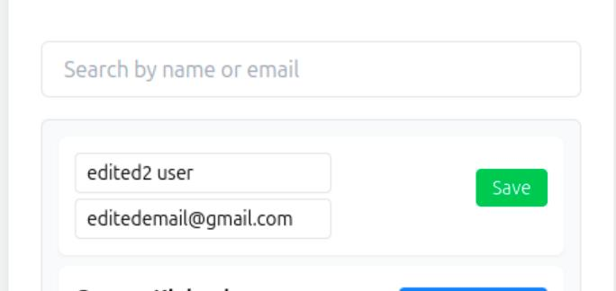
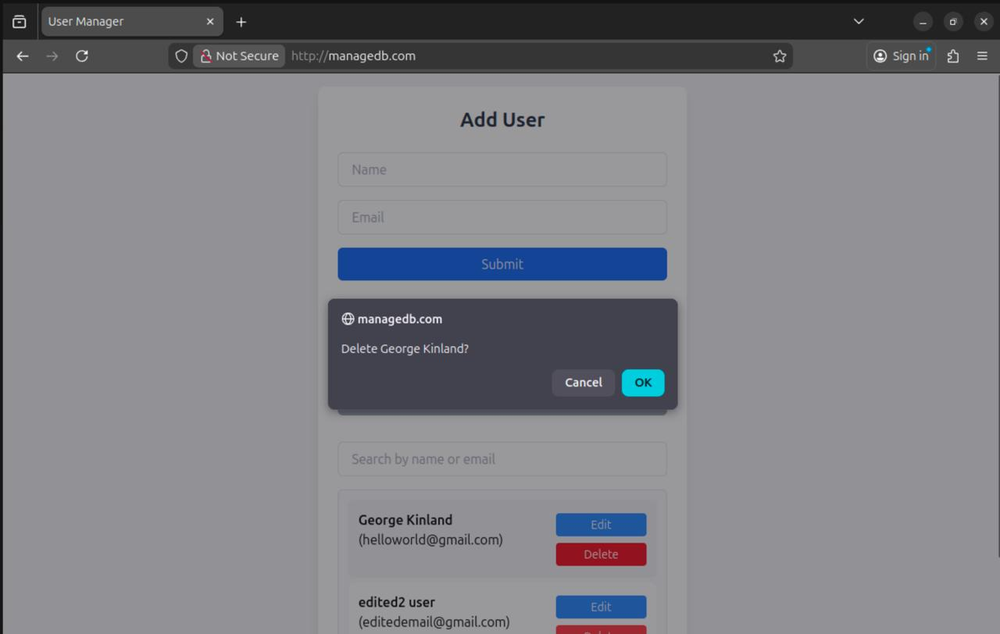

# Web Application for User Management

## Overview
This application allows you to:
- Add new users.
- View a list of users.
- Update user details.
- Delete users.
  Data is stored in a PostgreSQL database running within a Kubernetes pod in `database` namespace.

---
## Installation

### Installation Steps
1. Clone the repository
2. Paste your data in secret manifests

2. Apply all `.yaml` files in this order:
    1. `kubectl apply -f secret-back.yaml`
    2. `kubectl apply -f secret-db.yaml`
    3. `kubectl apply -f database-pvc.yaml`
    4. `kubectl apply -f backend.yaml`
    5. `kubectl apply -f database.yaml` 
    6. `kubectl apply -f ingress.yaml`

3. Exec command in database pod to create a table with users

`kubectl exec -n database <pod-name> -- psql -U <username> -d <dbname> -c "CREATE TABLE users ( id SERIAL PRIMARY KEY, name TEXT NOT NULL, email TEXT UNIQUE NOT NULL, date_registered TIMESTAMP DEFAULT now() NOT NULL );"`

4. Write this line in `/etc/hosts` for ingress

`<ingress ip>    managedb.com`

5. Go to managedb.com and try it!

## Screenshots

Here’s how the application looks in action:
- **Homepage with Add User Form**: 
- **User List searching**: 
- **Editing a User**: 
- **Deleting a User**: 